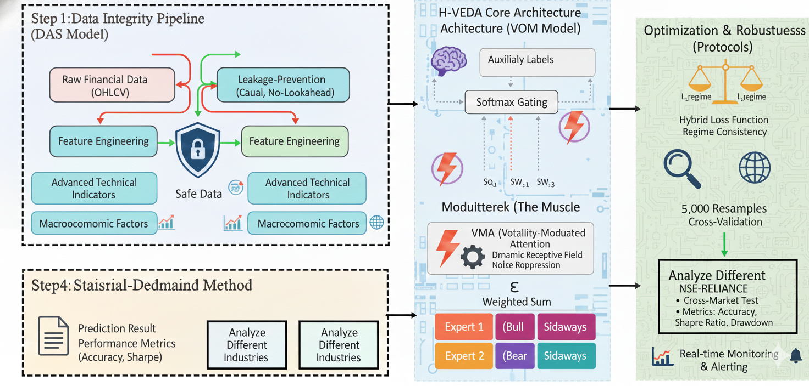

# H-VETA: Regime-Gated Mixture of Experts
 
 **H**ierarchical **V**olatility-**E**nhanced **D**ecision-making with **A**ttention
 
 金融时序预测的体制感知混合专家模型（Regime-Aware Mixture-of-Experts for Financial Forecasting）
 
 
 
 ---
 
 ## 项目概览
 
 H-VETA 是一个用于金融时序预测的体制感知混合专家（Mixture-of-Experts, MoE）框架。
 它在建模层面显式引入市场体制（regime）与波动率信息，以提升在不同市场状态下的稳定性与可解释性。
 
 ## 关键特点
 
 - **数据泄露防范**
   - 识别并规避 CEEMD / PCA 等处理流程中的 look-ahead bias 风险。
 - **体制监督的门控机制**
   - 通过体制标签（或体制 proxy）监督门控，缓解 expert collapse。
 - **波动率增强的注意力机制**
   - 风险感知的注意力/表示学习（Volatility-Enhanced / Risk-Aware）。
 - **可复现的实验管线**
   - 训练、评估、可视化与批量实验脚本均包含在仓库中。
 
 ## 快速开始
 
 ### 1) 安装依赖
 
 ```bash
 pip install -r requirements.txt
 ```
 
 ### 2) 运行实验/训练
 
 本仓库包含多个实验入口，常用的包括：
 
 ```bash
 python experiments/batch_experiment.py
 python experiments/run_indian_stocks_batch.py
 python experiments/run_quick_indian_test.py
 ```
 
 ### 3) 生成图表
 
 ```bash
 python scripts/create_visualizations.py
 python scripts/create_paper_figures.py
 ```
 
 ## 数据说明
 
 仓库中包含：
 
 - **Google 数据**: `data/googledata/`
 - **Indian stocks（标准化数据）**: `data/indian_stocks_standard/`
 
 说明：本仓库已通过 `.gitignore` 配置为只提交上述两个子目录的数据。
 
 ## 项目结构
 
 ```
 H-VETA/
 ├── src/                    # 核心模型与数据处理
 ├── scripts/                # 训练/评估/可视化脚本
 ├── experiments/            # 批量实验入口
 ├── docs/                   # 文档（报告/大纲/结果汇总）
 ├── data/
 │   ├── googledata/
 │   └── indian_stocks_standard/
 ├── figures/
 │   └── fig1_architecture.png
 └── requirements.txt
 ```
 
 ## 文档
 
 - `docs/PAPER_OUTLINE.md`
 - `docs/PAPER_FRAMEWORK.md`
 - `docs/EXPERIMENTAL_RESULTS_SUMMARY.md`
 - `docs/COMPLETE_DELIVERABLES.md`
 - `docs/TECHNICAL_REPORT_COMPLETE.md`
 
 ## 引用
 
 ```bibtex
 @article{hveta2024,
   title={H-VETA: Regime-Gated Mixture of Experts with Volatility-Enhanced Attention for Financial Time Series Forecasting},
   author={ziran-ai},
   year={2024}
 }
 ```
 
 **状态**: ✅ 可复现 | 📊 实验完成 | 📝 论文准备中
